# Big Picture of the Project and its process:  
    

### 1- Using AIML to evaluate marketing strategy

 Suppose you take part in a meeting to evaluate the probability of default payment by customers 
 
 Speaker represents the strategy and now is your turn to give suggestion   
 
  You can suggest this: Oh, let see what AI says 

### 2- Structure designer of the project and Python code writer 

 Here is the answer of AIML for your suggestion, please follow it. You will find some good ideas

 This code has user-friendly structure. It is classification issue in machine learning, as capstone project for `UC Berkeley Professional Certificate in AIML`, from `Berkeley Engineering` and `Berkeley HAAS`, and written by `Reza Zamani`

### 3- Process of the project
1- Business Understanding (Problem statement, purposes, questions, methodology, steps, phases of project)  
####  2- Data understanding  
####  3- Feature Engineering  
####   4- Train/Test split and handling imbalanced dataset    
####  5- Machine learning models and their evaluation before hyperparamter tuning   
####  6- Machine learning models after hyperparameter tuning  
####  7- Comparison of Models performance, evaluation, best model, and SHAP
####  8- Conclusion

## **4- Stages of Project** 

####  **1-First Phase:**  

 **Data Understanding**  
- **General checking: missing data, duplicate, incorrect data, ...**
-  **Target Variable Visualization**
- **Numerical Features Visualization**
- **Categorical Features Visualization**
- **Relationship between features, and their relationship with target**
- **Correlation problem**

 **Feature Engineering**  

 **Using algorithms, before hyperparameter tuning**  

 **Choosing the best algorithm with different criteria**  

####   **2-Second Phase:**  

-  **Tuning the hyperparameters**  

-  **Choosing best parameters for each algorithm**  

-  **Evaluating the algorithms with different criteria (accuracy, time, f1, precision, recall, ROC_AUC)**  

-  **Choosing the best algorithm with different criteria**  

####  **3-Third Phase:**  

-  **SHAP, and deployment**  

-  **Policy recommendation**  

# 1- Business Understanding 

###   **1-1-Main Research Question**  
-  **Can Machine Learning models accurately predict whether credit card customers will default or not?**

###  **1-2-Other Research Questions**   
- **What are the main factors affecting the probability of default by customers?**

- **what are the relative importance of factors affecting the probability of default by customers?**

###  **1-3-Problem Statement** 
Customers and also managers of financial institutions- a credit card financial institutions - want to have a better understanding of the factors that impact credit card payment default and get a solution in place that can predict with high accuracy whether customers will default on payments.

To solve this problem we use a dataset that contains credit card payment information and it is our task to determine what factors impact payment default as well as build a model or an ensemble of models that can predict default.

From the standpoint of risk management, the predictive accuracy of the predicted chance of default will be more valuable than the binary outcome of classification - credible or not credible clients. We must determine which clients will fall behind on their credit card payments. Financial dangers are demonstrating a trend regarding commercial bank credit risk as the financial industry has improved dramatically. As a result, one of the most serious risks to commercial banks is the risk prediction of credit clients. The current project is being created in order to analyses and predict the above-mentioned database. This research aims to identify credit card consumers who are more likely to default in the next month.

###  **1-4-Main Goal** 
- **Using AIML models, predict whether credit card customers will default or not**

###  **1-5-Other Goals** 
- **Determine main features have the highest impact on credit card default**

- **Understand the relationship between features together**

- **Understand the mechanism through which features affect default payment as target variable**

###  **1-6- Methodology** 
- **Classification**
###   **1-7-Stages of Poject**  

###  **1-8-Methods (AIML algorithms)**

-  **Logistic Regression**

-  **K-Nearest Neighbors (KNN)**

- **Decision Trees**

- **Support Vector Machine (SVM)**

- **Random Forest**

- **AdaBoost**

- **XGBoost**

- **Multi Layer Perceptron (MLP)**

#  **2- Data Understanding** 
##  **2-1-Load Dataset**  
##  **2-2- Understanding the Features** 

***Input variables:*** 

* **ID:** Unique ID of each client
* **LIMIT_BAL:** Amount of the given credit (NT dollar): it includes both the individual consumer credit and his/her family (supplementary) credit.
* **Gender:** 1 = male; 2 = female
* **Education:** 1 = graduate school; 2 = university; 3 = high school; 4 = others
* **Marital status:** 1 = married; 2 = single; 3 = others.
* **Age:** Age in years

**History of past payment.**

From April to September of 2005, we tracked historical monthly payment records. The payback status is measured using the following scale: -2=no spending, -1=paid in full, and 0=use of revolving credit (paid minimum only).

1 = payment delay for one month; 2 = payment delay for two months; . . .; 8 = payment delay for eight months; 9 = payment delay for nine months and above.

* **PAY_0:** Repayment status in September 2005

* **PAY_2:** Repayment status in August 2005

* **PAY_3:** Repayment status in July 2005

* **PAY_4:** Repayment status in June 2005

* **PAY_5:** Repayment status in May 2005

* **PAY_6:** Repayment status in April 2005

**Amount of bill statement (NT dollar).**
* **BILL_AMT1:** Amount of bill statement in September 2005

* **BILL_AMT2:** Amount of bill statement in August 2005

* **BILL_AMT3:** Amount of bill statement in July 2005

* **BILL_AMT4:** Amount of bill statement in June 2005

* **BILL_AMT5:** Amount of bill statement in May 2005

* **BILL_AMT6:** Amount of bill statement in April 2005

**Amount of previous payment (NT dollar).**
* **PAY_AMT1:** Amount of previous payment in September 2005

* **PAY_AMT2:** Amount of previous payment in August 2005

* **PAY_AMT3:** Amount of previous payment in July 2005

* **PAY_AMT4:** Amount of previous payment in June 2005

* **PAY_AMT5:** Amount of previous payment in May 2005

* **PAY_AMT6:** Amount of previous payment in April 2005
 

**Output variable (desired target):**  

* **default.payment.next.month:** Default payment (1=yes, 0=no)
 
###   **2-3- General check of data, info, missing and duplicate** 
-Missing data, outlier and duplicated data are checked. 
- **Handling Missing Values:**
   - `No missing values`. 
###   **2-4- checking Variables correctness** 
 **Data correcting:**
   - 9 Features have some incorrect data:  `EDCATION', 'SEX', 'MARRIAGE' and 'PAY_1' to 'PAY_6'
   - we correct mistakes
###  **2-5-Data Wrangling** 
   - rename most of features to be easily followed
   - change variables education, sex, and marriage from numerical to categorical data to follow easily and make sense 
   - change target variable in this phase from numerical to categorical, later after data visualization we will change it again to numerical
###  **2-6- Target variable Analysis** 
- we have imbalanced dataset, then our project in imbalanced dataset classification
  
- target`         `Percent
  
-No`              `0.78

-Yes`             `0.22

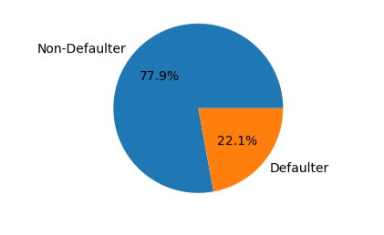

###  **2-7- Numerical variables visualization** 
  
- **Numerical features:**
- `LIMIT_BAL`,`AGE`,
- `'PAY_SEPT`, `PAY_AUG', 'PAY_JUL', 'PAY_JUN', 'PAY_MAY', 'PAY_APR`,
- `BILL_AMT_SEPT', 'BILL_AMT_AUG', 'BILL_AMT_JUL', 'BILL_AMT_JUN', 'BILL_AMT_MAY','BILL_AMT_APR`,
- `'PAY_AMT_SEPT', 'PAY_AMT_AUG', 'PAY_AMT_JUL', 'PAY_AMT_JUN', 'PAY_AMT_MAY', 'PAY_AMT_APR'`,
- **using different methods for visualization:**
- #### **`scatterplot, histplot, violinplot, catplot, pariplot, kdeplot, boxplot, barplot`**
- we got various general point for numerical features and their effect on target variable (default payment)

###  *2-7-1- Visualization of "LIMIT_BAL" feature (balance limit)* 
 
####  Points for "LIMIT_BAL" feature and its effect on target:  
1.   as the balance of credit increases, the probability of default decreases     
2.    the average of credit balance for people who has default is around half of people do not default.
3.     Most of people have credit balance smaller than $300k  
4.     Maximum Credit card limit is below 100k 
5.     Very few Credit Limit are above 500k 
6.      When credit limit is less than equal to 50k or smaller default ratio is high  
7.     Default ratio is exceptionally high when credit limit is 550000 and 600000  

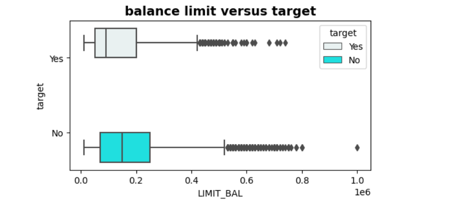

###  *2-7-2- Visualization of "age" feature* 
 
####  Points for "age" feature and its effect on target:  
1.   maximum default in male is in the age 29  
2.  maximum default in female is in the age 27  
3.  age 31-40 has the lowest probability for default (20%)   
4.  age 71-80 has the highest probability for default (more than 33%)   
5.  age 21-30 has the second lowest probability for default   
#### 6.  important point: probability of default 31-40 < 21-30 < 41-50 < 51-60< 61-70 < 71-79 

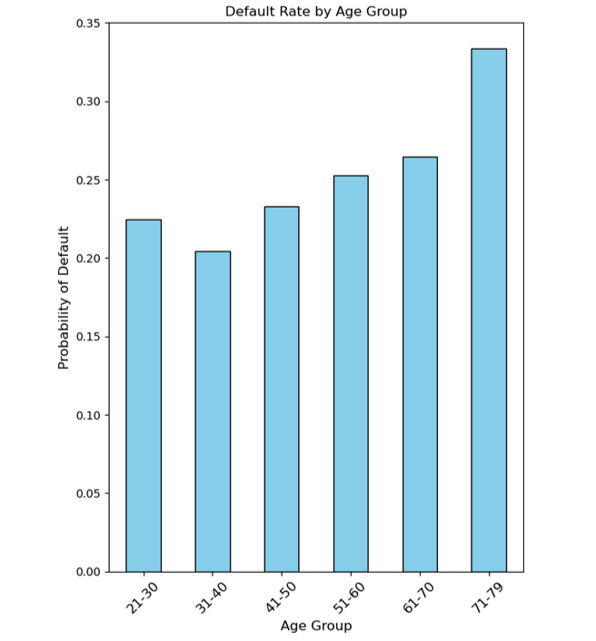

AGE_DEFAULT
###  *2-7-3- Relationship between age and other factors* 
 
####  Points for relationship between "age" and "balance limit"  
1.  age between 20-30 has the minimum balance     
2.    age between 70-79 has the maximum balance 
3.  at first the balance increases as age goes up, but then decrease, and in retirement it increase again   

   
### *2-7-4- Visualization of history of payments* 
 
 
 
####  Points for "history of payment" feature and its effect on target:  
1.  **Remarkable ratio** of people have only **paid the minimum**   
2.   customers who pay only the minimum amount have a higher risk of default
3.  customers ratio with **2 month default**  is high     
4.  customers ratio with **more than eight months default**  is high    
5.  all months have approximately similar KDE density function ratio with **more than eight months default**     

 
 
 
####  Points for distribution of "history of payment" feature  
1.  for all months, Interquartile (25) is on time payment   
2.  for all months, Interquartile (75) is 2 months delay in payment   
3.  for all months, more than 5 months delay in payment is very low 
 
### 2-7-4-1- Probability of default with attention to history of payments 
##### We focus here only on first and last months, as they are more important than others in affecting target variable 
#### Points for history of payment on September (last month):

- 1-	Default probability with full payment is 16%
- 2-	Default probability with having only part of payment is 13%
- 3-	Default probability with one month delay is 33%
- 4-	Default probability with two months delay is 69%, which shows there is a sharp increase from one month delay to two months delay 
- 5-	Default probability with three months delay is 75% and in maximum of default between all conditions 
- 6-	Default probability with four months to 8 months delay is 50% or more
- 7-	Default probability with more than 8 months is 13% 
- 8-	Generally, we see that first month delay is threshold point, as after that we see remarkable increase in default in second months. 
- 9-	Generally, fully payment has the minimum probability of default
  
#### Points for history of payment on April (first month):
- 1-	Default probability with full payment is 19%
- 2-	Default probability with having only part of payment is 0%
- 3-	Default probability with one month delay is 51%
- 4-	Default probability with three to seven months delay are more than 60% and even in seven month delay it reaches to more than 80%
- 5-	Default probability with eight months delay is 100%
- 6-	Generally, probability of default is increasing from full payment to eight months delay. 
- 7-	Generally, we see that there is a sharp increase in the probability of default in second months delay, which shows month one and two are critical for default or not.
   
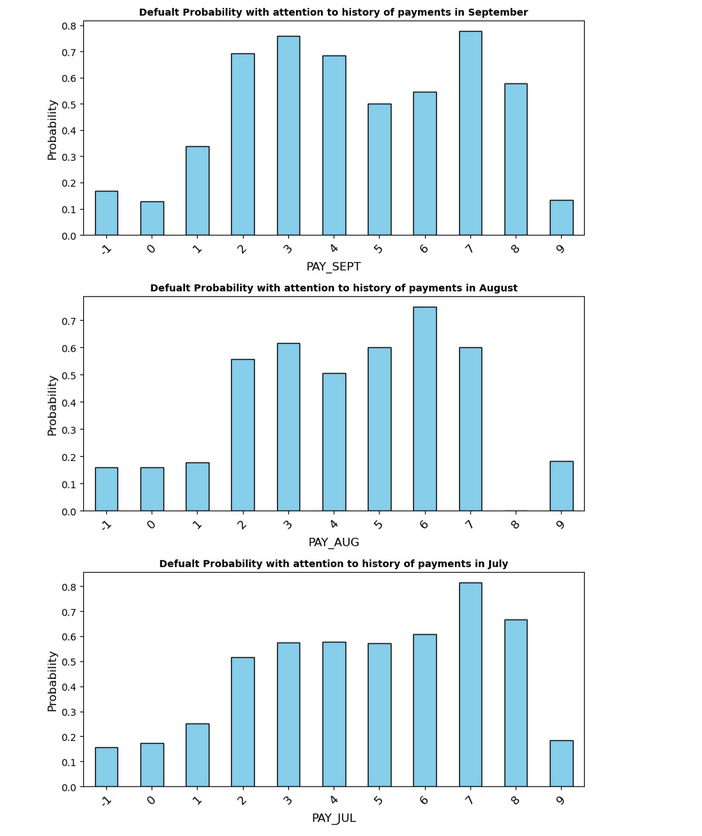

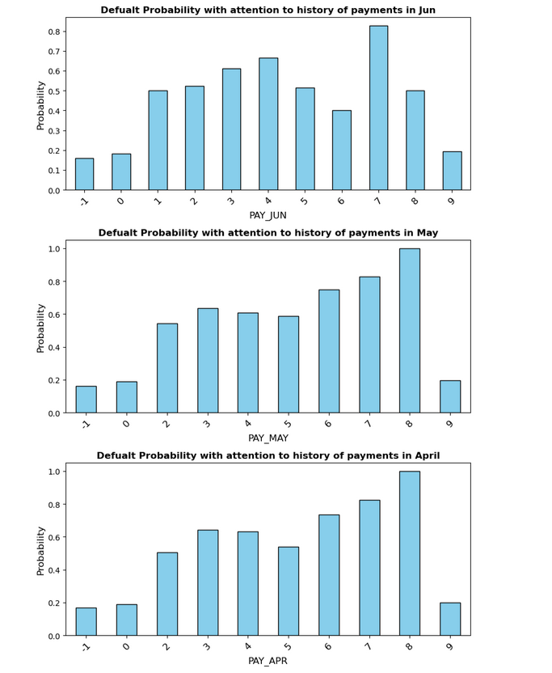

### *2-7-4-2- pairplot to have big picture*   

### *2-7-5- Visualization of Monthly Bill Amount* 

#### *2-7-5-1- Distribution of Monthly Bill Amount* 

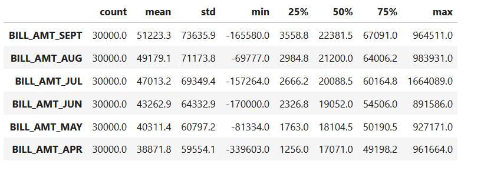

####  *2-7-5-3- pairplot of Bill Amount to have big picture and relationship between them* 
 
1.  main part of bill amount (Inter Quantile Range (IQR) for all six months is between 35k to 70k   
2.   as the number of previous months increases, the amount of 25%, 50% and 75% decreases 
3.   From pariplot, it seems some of them have correlation
   
###  *2-7-6- Visualization of Previous payment*  
 
 
 
1.  main part of bill amount (Inter Quantile Range (IQR) for all six months is between 4000 to 5000   
2.    25%, 50% and 75% quartiles decreases, as the previous month increases  
3.    mean of previous payment for six months does not have clear trend, but mean of previous payment is among 4800 to 5700 

#### *2-7-6-1- Distribution of pervious payment Bill Amount* 

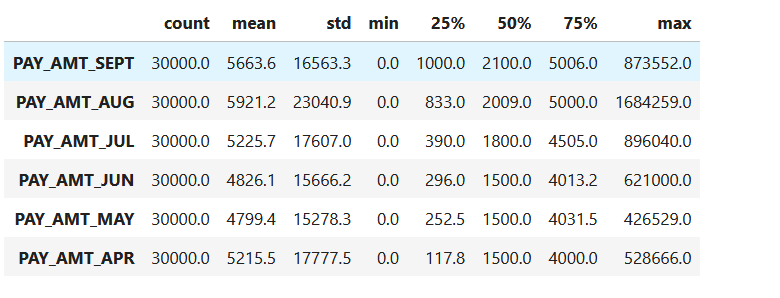

#### *2-7-6-3- pariplot of previous payment to have big picture and relationship between them* 

###  *2-7-6-4- Relationship between bill amount and previous payment in each month*  
 
 
 
1.  When Previous payment is low but Monthly Bill is high there is high possibility of default the payment.   
2.  approximately the distribution of default or payment for all six months are the same, when paying attention to the both  Previous payment and bill amount   

###  *2-7-7- Correlation between  numerical features* 
- We find some features have correlation with each other

###  **2-7-7-1-  using **VIF** to check the correlation conditions**
- using VIF, we find that four features (`BILL_AMT_AUG`, `BILL_AMT_MAY`, `BILL_AMT_JUL`, `BILL_AMT_JUN` have high correlation, then remove them from dataset
  
### **2-8-Categorical variable Analysis**
- Categorical features are: ‘EDUCATION`, `SEX`, and `MARRIAGE`
- For categorical data, we check distribution of each feature (with counplot), their effect on target variable with heatmap, and their relationship with default payment.  
###  *2-8-1- Visualization of "gender" feature* 
1.  60% of sample is female and 40% is male     
2.    around 25% of male has default, and around 35% of male has default
3.     **Male has higher rate of default than Female**    

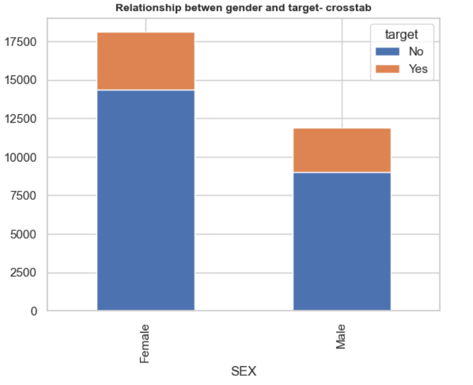

###  *2-8-2- Visualization of "education" feature* 
1.  45% of customers have university degree, after that 35% have graduate school.     
2.    It seems people with high school has higher level of default

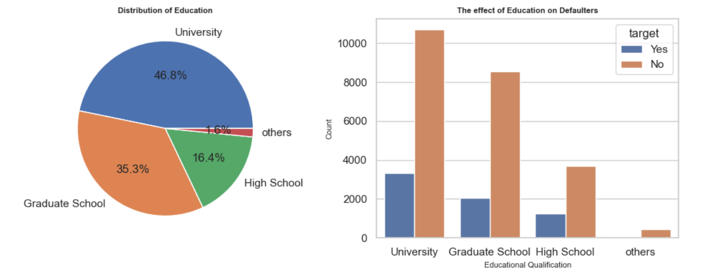
 
### *2-8-3- Visualization of "Marriage" feature*  
1.  53% of customers are single and 45% are married.   
2.   but the number of default for married and single are similar
2.    **is seems Married people have higher level of default than single**

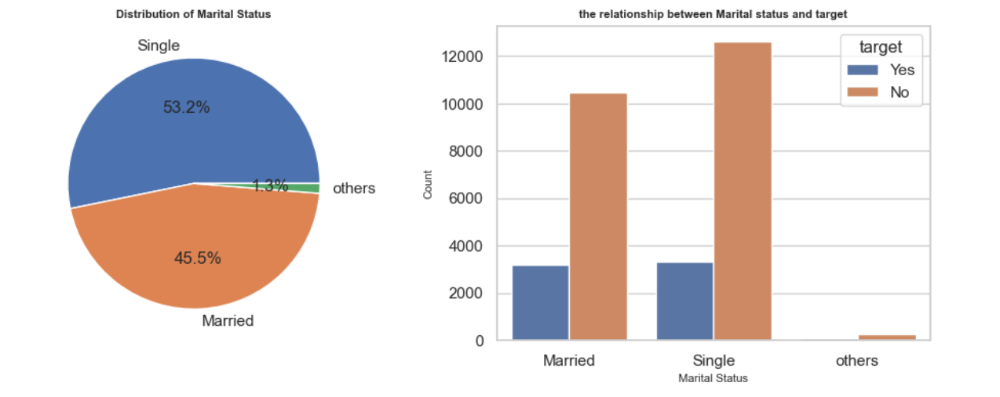

### *2-8-4- Heatmap for categorical variables* 

### *2-8-5- Probability of default with attention to categorical variables*
 
1.  **people with high school degree have the highest default (25%), followed by university degree (23%), and Graduate School (19%) and others (7%)**   
2.    **single people (22%) has the lowest level default, followed by married (23%) and others (24%)**
3.    **default of male (24%) is higher than female (21%)**

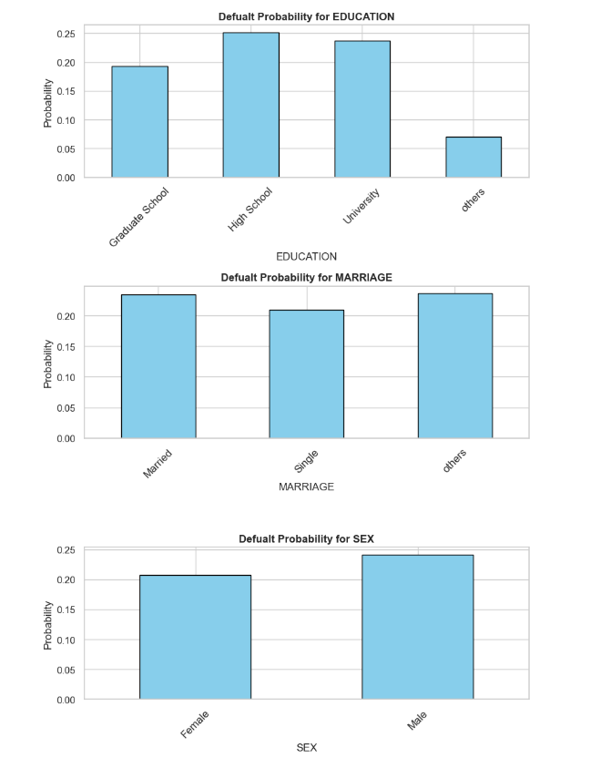

### *2-8-6- Relationship between balance limit, education, gender, and marriage* 
1.  Maximum money in account belongs to people with graduate school degree     
2.  Minimum money in account belongs to people with high school degree   
3.  bill amount for female is higher than male     
4.  it shows that male is risk lover than female 
5.   "Married" group has the maximum bill amount   
6.  "Others" group has the minimum bill amount 

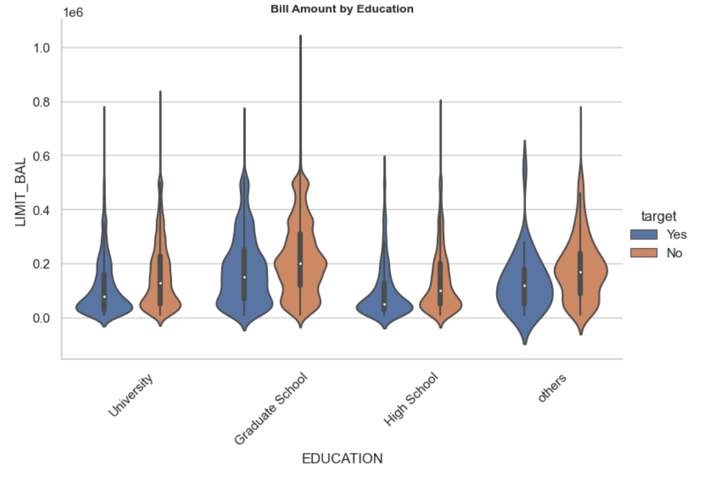

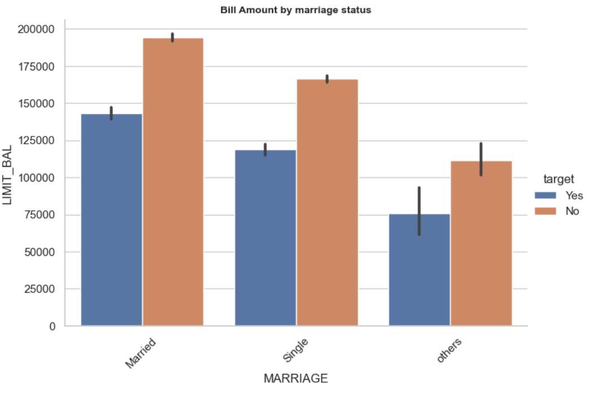
  
# **3- Engineering Features** 
- 1- check the dataset info to be sure have all data or do not have extra 

- 2- Split the data into features and target

- 3- Identify `categorical and numerical columns`

- 4- `Encode the target variable` with `LabdelEncoder()`

- 5- `OneHotEncoder` fo categorical and `StandardScaler()` for numerical variables 

#  **4- Train/test split and Handling Imbalanced Datasets**   
##  **4-1-Train/Test Split** 
With data prepared, we split it into a train and test set.

##   **4-2-SMOTE method for Imbalanced Dataset**   

 
 Our target variable in imbalance, then we should use the approach attention to this.

There are different approaches to split imbalance classification. Here are some of them 

1. **Oversampling**
- SMOTE (Synthetic Minority Over-sampling Technique)
- ADASYN (Adaptive Synthetic Sampling)
- Random Oversampling (Simply duplicates minority class instances)
2. **Undersampling**
- Random Undersampling
- Tomek Links (Removes borderline samples)
- NearMiss (Keeps only the hardest-to-classify examples)
3. **Hybrid Methods**
- SMOTE + Tomek Links
- SMOTE + Edited Nearest Neighbors (ENN)
4. **Class Weighting**
5. **Algorithm-Level Methods**
6. **Data Augmentation**

### We choose SMOTE

#### 1.   **At first we split data into train and test, then applied SMOTE, then model does not have data leakage**    
#### 2.   **Moreover, in this project, we find that if we apply SMOTE before splitting the data, we will have overfitting or underfitting, I Learn it from my supervisor in UC Berkeley**  
#### 3.   **As we applying train/test at first, then applying SMOTE, we do not have data leakage and also check and find there is not any overfitting**  

#   **5- Machine learning Models**  
Strategy:

- 1-At first we define and fit each model
- 1- in each model, we see accuracy
- 2- in each model, we see classification report
- 3- check train score, test score, fitting time, precision, recall and f1
- 4- create dataframe to see all score together
- 5- with attention to all criteria, choose the best model in this step
- 6- we do not tune the models in this section, we will tune the models in next section
####   **5-1-Decistion Tree**  
####   **5-2-XGBoost**  
####   **5-3-KNN (K-Nearest Neighbors)**  
####   **5-4-Logistic regression**  
####   **5-5-Random Forest** 
####   **5-6-AdaBoost**  
####   **5-7-SVM (Support Vector Machine)**  
####   **5-8-MLP (Multi Layer Perceptron)**  

Evaluation: 

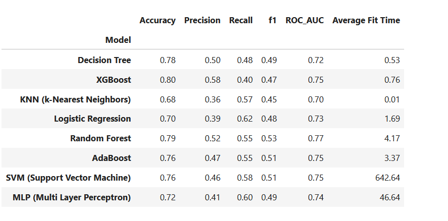

##   **5-9-Best Model**  
###   **in this step, best model is chosen before tuning the hyperparameters** 

1- **Accuracy**: 

- `XGBoost` has maximum score, followed by `random forest` and `decision trees`  

2- **Precision**: 

- `XGBoost` has maximum score, followed by `random forest` and `decision trees`  

3- **Recall**: 

- `Logistic regression` has maximum score, followed by `MLP` and `SVM`  

4- **f1**: 

- `Random forest` has maximum score, followed by `AdaBoost` and `MLP`

5- **ROC_AUC**: 

- `Random forest` has maximum score, followed by `AdaBoost`, `XGBoost` and `SVM`
  
6- **Fit Time**: 

- `KNN`, `Decision Tree`, and `XGBoost` have the minimum Average Fit Time 

- `SVM` and `MLP` have the maximum Average Fit Time
    
##  **Best model before hyperparameter tuning**: **Random Forest**    
- **It has maximum ROC_AUC**
- **It has the second maximum accuracy**
- **It has the maximum f1**
- **It has the maximum Recall**
- **It has also relatively low fit time**

#   **6- Models with hyperparameter tuning (best parameters)**   

####   **6-1 Decision Tree (best parameters)**   
####   **6-2-KNN (best parameters)**  
####   **6-3-SVM (best parameters)**  
####   **6-4- logistic Regression( best parameters)**  
####   **6-5-Random Forest ( best parameters)**  
####   **6-6-AdaBoost (best parameters)**  
####   **6-7-XGBoost (best parameters)**  
####   **6-8-MLP (Multi Layer Perceptron) (best parameters)**  

 **Here are the results:**
- 1- Best Params for Decision Tree classification is : {'model__criterion': 'log_loss', 'model__max_depth': 10, 'model__max_features': 'sqrt'}
  
- 2- Best Params for KNN classification is: {'model__n_neighbors': 2, 'model__p': 1, 'model__weights': 'distance'}

- 3- Best Params for SVM classification is : {'model__C': 1, 'model__kernel': 'rbf'}
  
- 4-Best Params for Logistic Regression classification is: {'model__C': 1, 'model__max_iter': 100, 'model__solver': 'liblinear'}
  
- 5- Best Params for Random Forest classification is : {'model__max_depth': 10, 'model__max_features': 'sqrt', 'model__n_estimators': 50}

- 6- Best Params for AdaBoost classification is : {'model__learning_rate': 1, 'model__n_estimators': 100}

- 7 - Best Params for XGBoost classification is: {'model__learning_rate': 0.1, 'model__max_depth': 10, 'model__n_estimators': 100}

-8-  Best Params for MLP classification is: {'model__activation': 'relu', 'model__hidden_layer_sizes': (5,)}

#   **7- Comparison of tuned models (with best parameters)**  

####   **7-1- Pipeline for best parameters for each model**   
####   **7-2-Fit the models and make prediction**   
####   **7-3- Evaluation**  

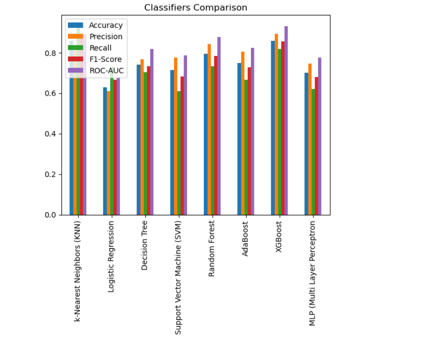

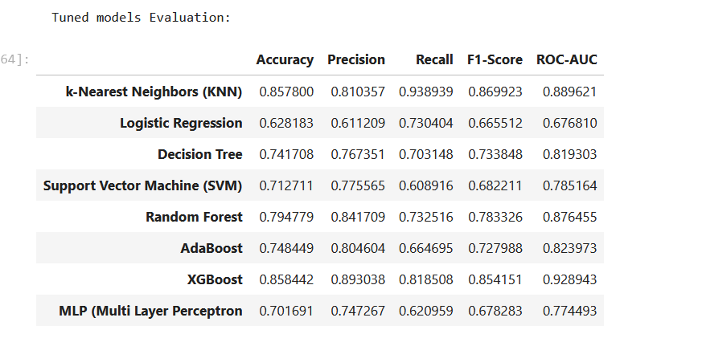

*******************************************************
KNN Accuracy: 0.86

KNN Classification Report:
               precision    recall  f1-score   support

           0       0.93      0.77      0.84      4613
           1       0.81      0.94      0.87      4733

    accuracy                           0.86      9346
    macro avg      0.87      0.86      0.86      9346
    weighted avg   0.87      0.86      0.86      9346

*******************************************************
Decision Tree Accuracy: 0.74

Decision Tree Classification Report:
               precision    recall  f1-score   support

           0       0.72      0.78      0.75      4613
           1       0.77      0.70      0.73      4733

    accuracy                           0.74      9346
    macro avg       0.74      0.74     0.74      9346
    weighted avg    0.74      0.74     0.74      9346

*******************************************************
SVM Accuracy: 0.71

SVM Classification Report:
               precision    recall  f1-score   support

           0       0.67      0.82      0.74      4613
           1       0.78      0.61      0.68      4733

    accuracy                           0.71      9346
    macro avg      0.72      0.71      0.71      9346
    weighted avg   0.72      0.71      0.71      9346

*******************************************************
Logistic Regression Accuracy: 0.63

Logistic Regression Classification Report:
               precision    recall  f1-score   support

           0       0.65      0.52      0.58      4613
           1       0.61      0.73      0.67      4733

    accuracy                           0.63      9346
    macro avg      0.63      0.63      0.62      9346
    weighted avg   0.63      0.63      0.62      9346

*******************************************************
Random Forest Accuracy: 0.79

Random Forest Classification Report:
               precision    recall  f1-score   support

           0       0.76      0.86      0.81      4613
           1       0.84      0.73      0.78      4733

    accuracy                           0.79      9346
    macro avg      0.80      0.80      0.79      9346
    weighted avg   0.80      0.79      0.79      9346
*******************************************************
AdaBoost Accuracy: 0.75

AdaBoost Classification Report:
               precision    recall  f1-score   support

           0       0.71      0.83      0.77      4613
           1       0.80      0.66      0.73      4733

    accuracy                           0.75      9346
    macro avg      0.76      0.75      0.75      9346
    weighted avg   0.76      0.75      0.75      9346
*******************************************************
XGBoost Accuracy: 0.86

XGBoost Classification Report:
               precision    recall  f1-score   support

           0       0.83      0.90      0.86      4613
           1       0.89      0.82      0.85      4733

    accuracy                           0.86      9346
    macro avg      0.86      0.86      0.86      9346
    weighted avg   0.86      0.86      0.86      9346

*******************************************************
MLP Accuracy: 0.70

MLP Classification Report:
               precision    recall  f1-score   support

           0       0.67      0.78      0.72      4613
           1       0.75      0.62      0.68      4733

    accuracy                           0.70      9346
    macro avg      0.71      0.70      0.70      9346
    weighted avg   0.71      0.70      0.70      9346
*******************************************************
####   **7-4- Plotting ROC curve**  

####   **7-5-  Confusion Matrix**  
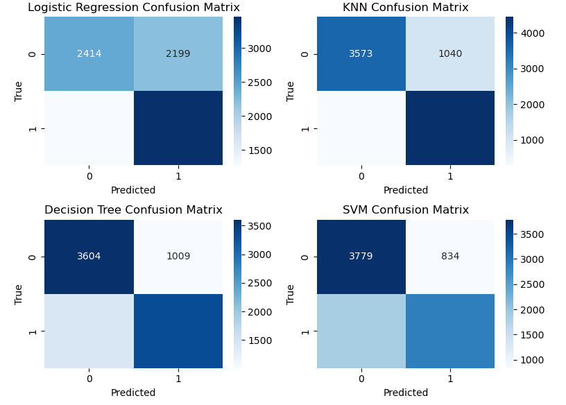
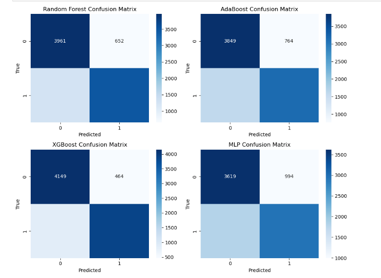
###   **7-6-Best Model after tuning the hyperparameters**  

 
    
1- **Accuracy**: 

- `KNN`  and  `XGBoost`   have maximum  score, followed by `Random Forest`. 

2- **Precision**: 

- `XGBoost` has maximum score, followed by `random forest` and `KNN`  

3- **Recall**: 

- `KNN` has maximum score, followed by `XGBoost`  

4- **f1**: 

- `KNN` has maximum score, followed by `XGBoost`

5- **ROC_AUC**: 

- `XGBoost` has maximum score, followed by `KNN`.

  
###  **Best model** after hyperparameter tuning: **KNN**    
- **It has the maximum f1**
- **It has the maximum Recall**
- **It has the maximum accuracy**
- **It has the second maximum ROC_AUC**
- **It has the third maximum Precision**

###  **Second Best model** after hyperparameter tuning: **XGBoost**    
- **It has the maximum Precision**
-  **It has the maximum ROC_AUC**
- **It has the maximum accuracy**
- **It has the second maximum Recall**
- **It has the second maximum f1**

##   **7-7-feature importance and SHAP**  
#####   **7-7-1-Feature Importance with the second best model (XGBoost)**  
#####   **7-7-2-Feature Importance with the best model (KNN)**  

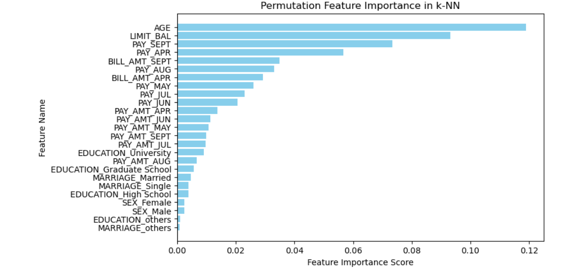
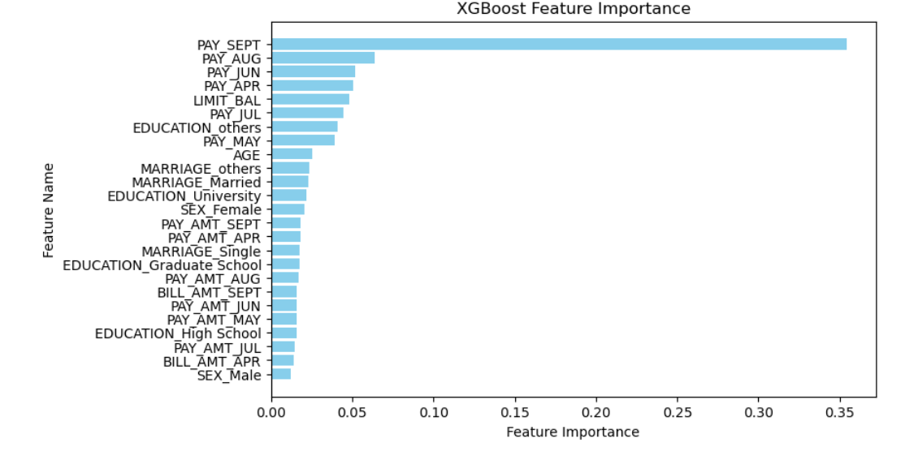

#####   **7-7-3-SHAP  for the second best model (XGBoost)** 
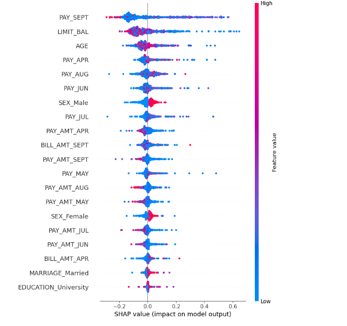
                                                                                    
#####   **7-7-3-SHAP  for the best model (KNN)**  
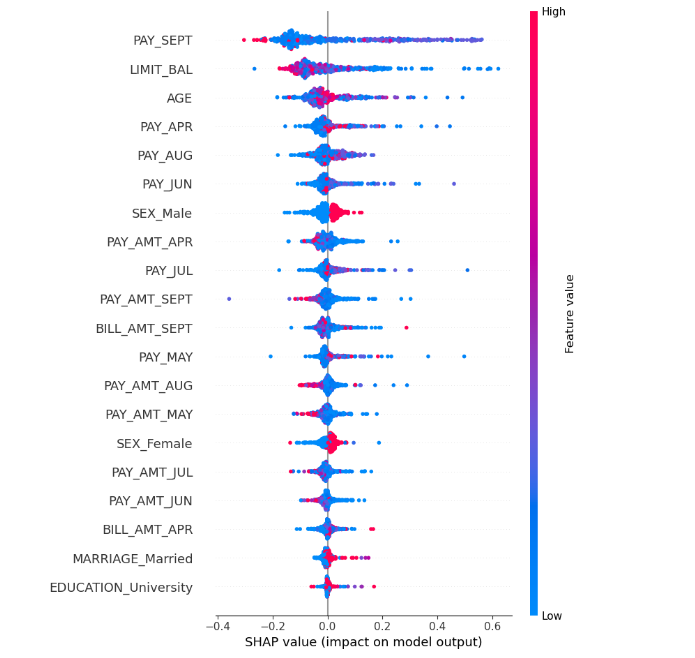

 

#  **Main results from SHAP and feature importance:** 

##  **1-3-Top Three features affecting the target:** 
##  **AGE**, 
##  **PAY_SEPT**,
##  **LIMIT_BAL** 
##
### **Other findings:**
### 4- **History of payment**:
- it is generally important as its elements have relatively high raking in SHAP and **three among top five ranking** (`PAY_SEP`, `PAY_ARP`, `PAY_AUG` ) are among top five features
### 5- **PAY_AMT**:
- among different months, **April** has the **highest impact**, followed by **September**
### 6- **BILL-AMT**: 
- bill amount of **September** has the **highest impact** among BILL_AMT, followed by April
### 7- **Among months**:
- **previous month is most important**.
-  We have the feature for each six previous months (history of payment, last payment, and last bill). Among all six previous months, last month (in feature September) is most important, as PAY_AMT, BILL_AMNT_SEP, and PAY_AMNT_SEP have higher ranking from other months in similar situation.
### 8- **Among months**:
**sixth previous month is the second most important**.
- By following all features for each month in SHAP (history of payment, last payment, last bill), we find that after September, April in the second important month. It shows that as financial institution, if you want to check the condition of customer, at first see the previous month, then go and check the six previous months, as it is more important the other months.
### 9- **SEX**:
- In SHAP, Male has higher ranking than Female, but has lower ranking in feature important. When we look at carefully to the colors and value in SHAP, we find that the probability of default by Female is lower which is compatible with data understanding we have and with feature importance
### 10- **MARRIAGE**:
- in SHAP (in both of them), we have only `MARRIAGE_Married', but looking at to feature importance, we have married and single with higher ranking for marries. We also find in data understanding that single has lower risk than married. 
### 11- **EDUCATION**:
- in SHAP, we have only `EDUCATION_University` as important factor affecting target. Feature important also shows that university degree has higher ranking, followed by graduate school and higher school. This finding in compatible with data understanding.  

 

#   **Interpretation** of results from SHAP and feature importance: 

##  **1- PAY_SEPT** 
#### 1-1- Last month is very important. If someone has delay in last month in payment or default, the probability of default in next month will be very high.
#### 1-2- Therefore there is maximum risk of default. As financial institution, if you see your customer has default in last month, try to call him/her to prevent from default in next month.
#### 1-3- Moreover as we find in data understanding section, if someone has default for two months, it would be possible to continue default or delay for all months. There is a sharp increase in probability of default for from one month delay to two months delay in payment, which shows one month delay in critical month, if a cusotmer passes this critical point, the risk of default inceases sharply from 33% in first month delay to 69% in second month delay. 

##  **2- LIMIT_BAL**  
#### 2-1- it is an important feature affecting default.
#### 2-2- When this feature for a customer is increasing it means the customer is using more and more from credit card, which shows his debt are increasing. 
#### 2-3- Higher amount of credit card leads to higher risk of default. 
#### 2-4- As financial institution, when you see the trend of using credit card by customer and his/her family is increasing sharply, the probability of default is increasing too

##  **3- AGE**  
#### 3-1-Age is an important feature affecting the default payment
#### 3-2- Age group of 31-40 has the minimum probability of default, followed by age group of 21-30, 41-50 
#### 3-3- Age group of 71-80 has the maximum probability of default, followed by age group 61-70. 
#### 3-4 - As financial institution, you should more care from people who has more than 70 years of old.
#### 3-5- As financial institution, if you are conservative about default, you can more focus on people with age more than 60. 

###  **Customers with very high risk of default:**
#### Age group 71-80 
###  **Customers with high risk of default:**
#### Age group 61-70 
### **Customers with low risk of default**: 
#### Age group 31-40 
###  **Age with middle risk of default**: 
#### 21-30, 41-60 

## **Other findings:**

### 4- **History of payment**: 
#### Previous behavior of each customer can act as proxy for next behavior. Behavior of customer in last month (`PAY_SEP`) and in six month before (`PAY_ARP`) are very important. It means if someone started in the last month to default or from the first month of our data started to default, he/she has higher probability to default again.

### 5- **BILL-AMT**: 
#### Moreover, the bill amount of last month is important too, higher bill amount in last month has positive impact on default in coming month.  

### 6- **Which month is important**:
#### We have three feature for each month, with attention to all information from SHAP, feature importance and data understanding:
#### - 6-1- **September** (last month)
#### - 6-2- **April** (first month)

#### This finding shows that if you want to check the behavior of customer check the first and last month behavior

### 7- **SEX**: 
#### Female has lower risk of default (21%) than Male (24%), but it is not so important factor.

### 8- **MARRIAGE**:
#### single people has the lowest level default (22%), followed by married (23%) and others (24%), but it is not important factor

### 9- **EDUCATION**: 
#### Customer with high school degree have the highest default (25%), followed by university degree (23%), and Graduate School (19%) and others (7%)

 

#   **8- Conclusion**  
##  **8- 1- Steps of the project (what we have done?)** 

 
  
### 1-  **Business understanding** 
    Purpose of this project is to predict the next behaver of customer that he or she will default or pay 
- 1-main question
- 2-other questions 
- 3-problem statement 
- 4-main goal
- 5- othe goals
- 6- methodology 
- 7- steps of project
- 8- methods 

#### 2-  **Data understanding**  
     Data understanding: In around 30k datasets (24 feature and 1 target),
    Target variable represents the default of payment.
- 1-load dataset 
- 2-undestanidng features 
- 3-general info, missing, duplicate 
- 4-checking correctness of variables and inside them 
- 5- data wrangling 
- 6-target variable analysis 
- 7- numerical variable visualization: visualization and correlation control  
- 8- categorical variable visualization 

### 3-  **Feature Engineering** 
  - 1- check the dataset info to be sure have all data or do not have extra 

- 2- Remove Highly Correlated feature

- 3- Split the data into features and target

- 4- Identify categorical and numerical columns

- 5- Encode the target variable

- 6- `OneHotEncoder` for categorical and `StandardScaler` for numerical variables 

### 4-  **train/test split and handling imbalanced dataset** 

- 1-train/test split
- 2-SMOTE method for imbalanced dataset

### 5-  **Machine learning models before hyperparameter tuning**  
- 1- decision trees 
- 2- KNN
- 3- SVM
- 4- Logistic Regression 
- 5- Random Forest 
- 6- AdaBoost 
- 7- XGBoost 
- 8- MLP (multi layer perceptron)

- we use not only test and train score, but also recall, precision, f1, classification report and confusion matrix.
  
- Best model before hyperparameter tuning
        
- 1- general finding 
- 2- comparison of model in test and train score
- 3- comparison by f1, recall and precision 
- 4- Average time fit 
- 5- choosing the best model and second and third models
  
   **best model is Random Forest (best)**, followed by XGBoost, and Decision Trees 

### 6-  **Models with hyperparameter tuning (best parameters)** 
    We define different parameters for our classifiers (8 classifiers) 
    and using gridsearch we find the best parameters for each classifier:
    
- 1- decision trees 
- 2- KNN
- 3- SVM
- 4- Logistic Regression 
- 5- Random Forest 
- 6- AdaBoost 
- 7- XGBoost 
- 8- MLP
  
### 7-  **Comparison of tuned models**  
     Again fit model with this classifiers with their best parameters and in    last step of modeling try to evaluate their performance.
    
- 1- pipeline for best parameters for each model
- 2- Fit the models and make prediction 
- 3- Accuracy and Classification report
- 4- Plotting ROC curve
- 5- Confusion Matrix
- 6- SHAP and feature importance
  
 **Best model after tuning the hyperparameters**  
     
- 1- General findings 
- 2- Best accuracy score
- 3- Best f1 score 
- 4- Best Recall score 
- 5- Best Precision score 
- 6- Best ROC-AUC
- 7- Choosing the best models

- Using confusion matrix, ROC curve, recall, precision and f1
- We find that among models with best parameters, **KNN** regression is the best.
  
- **KNN** followed by **XGBoost** are the best models 
  

 **Feature importance and SHAP**   
 Most important features: 
- LIM_SEP
- BILL_AMT
- AGE 

##  **8-2- Deployment** 
Now that we have settled on our models and findings, it is time to deliver the information to the client.  I am organizing my work as a basic report that details my primary findings.  Keep in mind that my audience are financial companies interested in fine-tuning their strategy in debt market and are sensitive to the default of payment by customers.

 

##  **1- Why we can trust to AIML model and its results and predictions**
 ####  Results of AIMl models are reliable, as our best and second best models have higher accuracy, recall, precision, f1 and ROC_AUC. All criteria are more than 80%, which shows results are acceptable. 

##  **2- What are the most important factors affecting the risk of default?** 
 Three top factors are affecting the risk of default are
- `AGE`,
- `PAY_SEPT`,
- and `LIMIT_BAL`

##  **3- How `AGE` is affecting the `risk of default`, can you devide people with age on high, low and middle risk of payment?**

- categorize people on decade into 21-30, 31-40, ...., 71-80

- The probability of default for each group is as following: 
- AGE_GROUP `       ` Risk of default
- 21-30`               `0.22
- 31-40`               `0.20
- 41-50`               `0.23
- 51-60`               `0.25
- 61-70`               `0.26
- 71-79`               `0.33
###

- Level of risk `                 `Age Group 
- Low risk`                          `31-40 
- High risk`                         `71-80
- Middle risk`                       `51-60 
- Lower middle risk`                 `21-30, 41-50 
- Upper middle risk`                 `61-70 

##  **4- How `PAY_SEPT` (history of last month) is affecting the `risk of default`?** 
#### Last month is very important. If someone has delay in last month in payment or default, the probability of default in next month will be very high.
#### Therefore, there is maximum risk of default. As financial institution, if you see your customer has default in last month, try to call him/her to prevent from default in next month.
#### Moreover, as we find in data understanding section, if someone has default for two months, it would be possible to continue default or delay for all months. There is a sharp increase in probability of default for from one month delay to two months delay in payment, which shows one month delay in critical month, if a customer passes this critical point, the risk of default increases sharply from 33% in first month delay to 69% in second month delay.

##  **5- How `LIMIT_BAL` (using of credit card) is affecting the `risk of default`?** 
 
#### It is an important feature affecting default.
#### When this feature for a customer is increasing it means the customer is using more and more from credit card, which shows his debt are increasing. 
#### Higher amount of credit card leads to higher risk of default. 
#### As financial institution, when you see the trend of using credit card by customer and his/her family is increasing sharply, the probability of default is increasing too

##  **6- How `History of payment` is affecting the `risk of default`?** 

#### Previous behavior of each customer can act as proxy for next behavior. Behavior of customer in last month (`PAY_SEP`) and in six month before (`PAY_ARP`) are very important. It means if someone started in the last month to default or from the first month of our data started to default, he/she has higher probability to default again.

##  **7- How `BILL-AMT` is affecting the `risk of default`?** 
#### The bill amount of last month is important. Higher bill amount in last month has positive impact on default in coming month.  

##  **8- Which `Month` has more valuable information about the `risk of default`?** 
#### We have three data for each month (history of payment, bill amount and pay amount). Generally two important months are: 
#### **`September`** (`last month`)
#### **`April`** (`first month`)
#### You should track this two months, they represents the behavior of customer
#### This finding shows that if you want to check the behavior of customer check the first and last month behavior

##  **9- How `Gender (SEX) ` is affecting the `risk of default`?** 
#### Female has lower risk of default (21%) than Male (24%), but it is not so important factor.

##  **10- How `MARRIAGE` is affecting the `risk of default`?** 
#### single has the lowest level default (22%), followed by married (23%) and others (24%), but it is not important factor

##  **11- How `EDUCATION` is affecting the `risk of default`?** 
#### Customer with high school degree have the highest default (25%), followed by university degree (23%), and Graduate School (19%) and others (7%)

